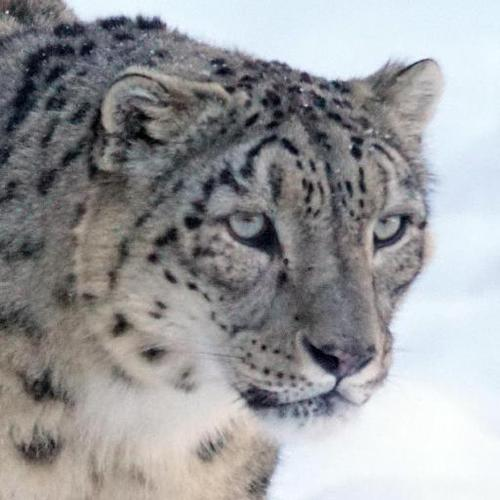

# Image-Search-Engine
## L’objectif du projet
Nous nous intéressons dans notre travail à la recherche d’images basées sur leurs attributs visuels(la couleur, la texture et la forme).
La recherche basée sur le contenu visuel se base sur l’extraction des attributs visuels des images de la base, et
les comparer à ceux de l’image requête.
L’objectif principal de ce projet est d’étudier le principe de la recherche d’images par
le contenu. Le deuxième objectif consiste à utiliser les connaissances tirées de cette étude et
construire un prototype d’un système de recherche d’images par le contenu.
## Interface

## Resultats

#### Input Image 

#### Resultat

#### Comment ca fontionne 

##### Remarque 
ceci est formé sur un ensemble de données spécifique et les index générés à l'intérieur de répertoire "Indexes" ne peuvent pas fonctionner avec votre propre ensemble de données.
vous devez donc générer vos propres index pour chaque type d'index mentionné ci-dessous en executant les fichers python suivants :

Apres vous devez juste executer le ficher TP2_traitemnt.py : python TP_traitemnt.py 

